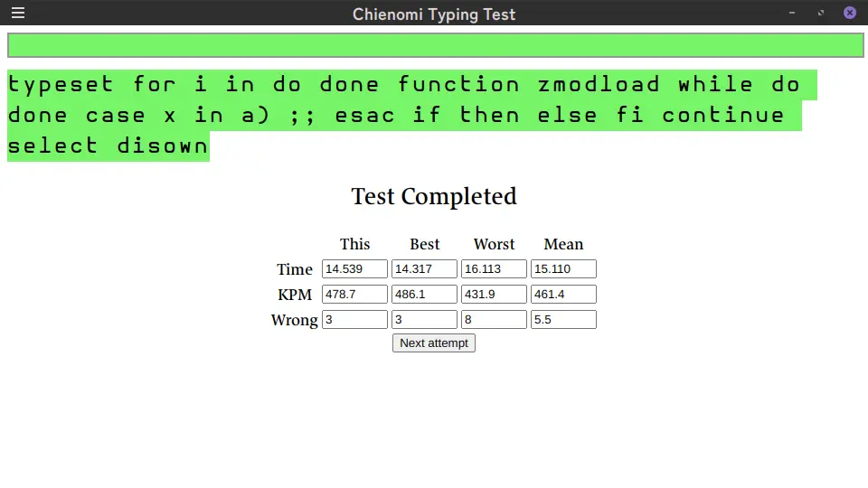
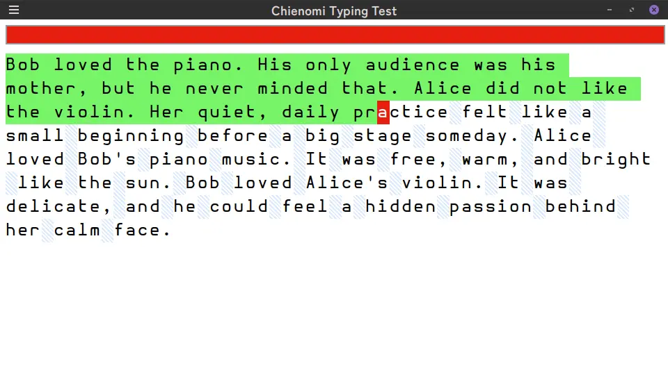

# chienomi-keytyping-testmethod

A smart, stable typing test with high validity as a benchmark. Primarily designed to measure keyboard performance.

## Screenshots

## Description

This software is a typing test tool designed for local measurement.

The test is provided as an HTML file and runs as a local web application.

Each test uses a fixed text. The software measures the time required to type the entire passage and calculates KPM (keystrokes per minute) based on the elapsed time. Mistypes are counted by the index at which the incorrect character occurs, and the result displays the total number of mistyped characters.  
For example, if the target string is `typing` and the user types `typooooing`, the number of mistakes is counted as **1**.

There is no need to correct mistakes manually. The index simply does not advance until the correct character is entered. If you notice a mistake, just type the correct character and continue.

This software was developed primarily for keyboard performance testing. For this reason, the rules are designed to ensure high reproducibility and stable results. Mistypes are displayed clearly for easy understanding.

You can attempt the test as many times as you like, and the best, worst, and mean results are shown.

The software does not save or transmit any data. All records are cleared when the page is reloaded.

Although the actual test uses the `"chienomi"` text, many additional passages are included so you can enjoy a variety of challenges. There are problem sets featuring programming language keywords as well as intentionally frustrating passages full of awkward words. Have fun exploring them.

## Usage

Open `index.html`.

## Test text status

|Title|Status|Description|
|-------|-----------|-----------------|
|develop|Change at any time|For development|
|prog0|Fixed|Programming basic|
|unix|Fixed|Unix basic commands|
|ruby|In development|Ruby basic|
|zsh|In development|Zsh basic|
|js|Maybe fixed|JavaScript basic|
|html|Maybe fixed|HTML elements and attributes|
|css|In development|CSS basic|
|css2|Fixed|Abrasive CSS statement|
|css3|Maybe fixed|Magic spell like CSS words|
|elixir|In development|Elixir basic|
|chienomi|In development|Main test for Chienomi|
|harukamy|Fixed|Fit to Harukamy's typing style|
|hellkamy|Fixed|Hell for Harukamy's typing style|
|en words|Maybe fixed|English words|
|en words long|Fixed|English words (competitive)|
|en sentence|In development|English sentence|
|prog complicated|Fixed|Hell complicated words in software|
